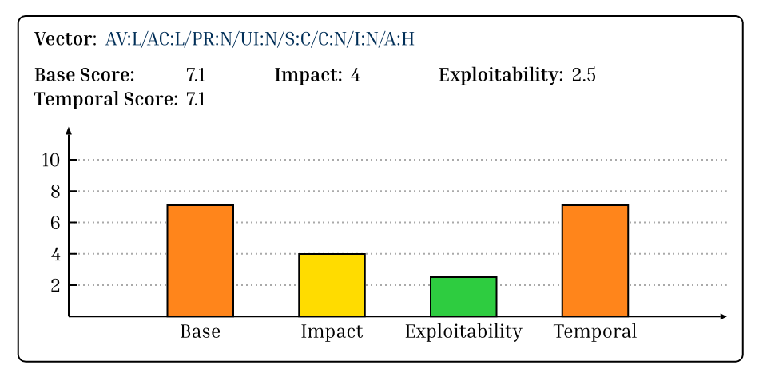

# typst-cvss-calculator

A small plugin for typst that can calculate CVSS scores from a CVSS vector.

## How to use

Using this plugin is relatively straight forward.
Simply copy the file `cvss.typ` into your project directory and you can use
it with the following lines:

```typst
#import "cvss.typ": cvss
#cvss("AV:L/AC:L/PR:N/UI:N/S:C/C:N/I:N/A:H")
```

The output of the above vector will look like this:



