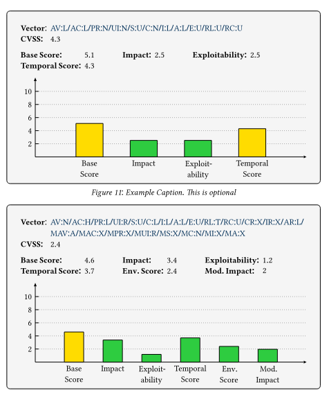

# typst-cvss-calculator

A small plugin for typst that can calculate CVSS scores from a CVSS vector.

## How to use

A CVSS statistic can be caculated from a CVSS vector and embedded into a document with the `cvss()` function.

### Parameters

```
cvss(
    [string],
    caption: [none][content],
    outlined: [bool],
) -> [content]
```

- **body [string]**: The CVSS vector.
- **caption [none][content]**: The caption of the figure. Default: 'none'.
- **outlines [bool]**: Whether the figure will be outlined. Default: 'true'.

## Example

```typst
#import "cvss.typ": cvss

//#cvss("VECTOR", caption: "CAPTION", outlined: true/false)
#cvss("AV:L/AC:L/PR:N/UI:N/S:U/C:N/I:L/A:L/E:U/RL:U/RC:U", caption: "Example Caption. This is optional")
#cvss("AV:N/AC:H/PR:L/UI:R/S:U/C:L/I:L/A:L/E:U/RL:T/RC:U/CR:X/IR:X/AR:L/MAV:A/MAC:X/MPR:X/MUI:R/MS:X/MC:N/MI:X/MA:X", outlined: false)
```

## Preview



